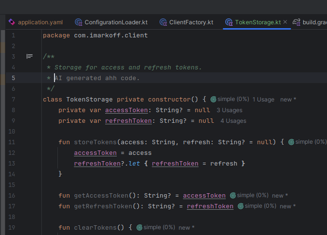

## Honorable mention

# mtdfit-client-sample

This project was created using the [Ktor Project Generator](https://start.ktor.io).

Here are some useful links to get you started:

- [Ktor Documentation](https://ktor.io/docs/home.html)
- [Ktor GitHub page](https://github.com/ktorio/ktor)
- The [Ktor Slack chat](https://app.slack.com/client/T09229ZC6/C0A974TJ9). You'll need to [request an invite](https://surveys.jetbrains.com/s3/kotlin-slack-sign-up) to join.

## Features

Here's a list of features included in this project:

| Name                                      | Description                                                 |
|-------------------------------------------|-------------------------------------------------------------|
| Authentication `POST: /auth/login`        | Basic authentication using a username and password          |
| Token-based authentication `POST: /token` | Authentication using a token                                |
| Account information `GET: /auth/me`       | Get information about the currently authenticated account   |
| Devices `GET: /token`                     | Get a list of devices                                       |

## Project Structure

The project is structured as follows:

| Path                    | Description                        |
|-------------------------|------------------------------------|
| `client`                | Configuration for the Ktor clients |
| `schemas`               | Data classes for the API responses |
| `schemas/enums`         | Enums for the data classes         |
| `services`              | Services for the API endpoints     |
| `utils`                 | Some helper functions              |
| `views`                 | Interface for the services         |
| `resources`             | Configuration files                |

## Building & Running

To build or run the project, use one of the following tasks:

| Task                          | Description                    |
|-------------------------------|--------------------------------|
| `./gradlew test`              | Run the tests (always passing) |
| `./gradlew build`             | Build everything               |

If the client starts successfully, 
you'll see logs with connection information and outputs from views.